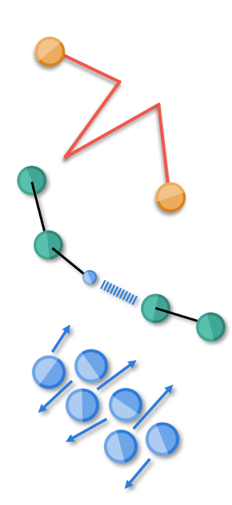

---
hide:
  - navigation
  - toc
---

# Welcome to mixturemm

**A python package for large-scale simulation and analysis of molecule mixtures, espacially solvents, in openMM on high performance clusters.**

>## Ideal for solvent parameter studies
>   
>###Automated simulation setup
>-   covers wished parameter space for temperature, pressure and dilutions with water
>-   creates predefined folder structure
>-   packs simulation boxes (by [packmol](https://github.com/m3g/packmol))
>-   stores short project description with metadata and input parameters as JSON
>###Simulation 
>-   with the fast simulation engine [OpenMM](https://openmm.org/)
>-   NpT to NVT to NVE ensemble according to simulation **Best Practices**
>-   semi-automated job submission to High Performance Computing Centers *via* SLURM
>###Analyses
>-   density
>-   self-diffusion-coefficients as well as finite size corrected self-diffusion-coefficient
>-   viscosity
>-   hydrogen bonds
>-   outputted as JSON

!!! info "Free sofware under the MIT license."