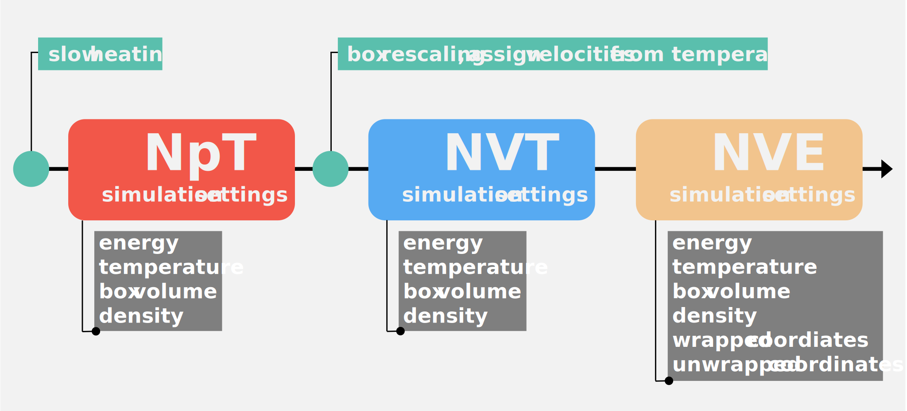

---
hide:
  - navigation
  - toc
---

# Scientific background

## Box packing

The boxes to be simulated are packed with the python package [packmol](http://m3g.iqm.unicamp.br/packmol). This package needs as starting point the PDB files of all occurring molecules and their desired number as well as the initial side length of the box in which the molecules should be packed. For each individual box there is an input file with this information, which is automatically generated during the workflow based on the existing information of the project object. With the given total number of molecules, their proportion in the mixture and the water mole fractions, the respective molecule number is calculated, assigned to the path to the PDB file of the molecule and the box is packed with the resulting input file. The resulting PDB file of the box does not contain any CONECT entries, however OpenMM needs this topology information to assign the molecules their respective force field. Therefore, in a further step, the CONECT entries of the box are created based on the indices of the CONECT entries of the individual molecules and added to the PDB file.

!!! info "CONECT entry indices generation"

    === "CONECT entries of methanol"

        ```
        CONECT    1    2    3                                                 
        CONECT    2    1                                      
        CONECT    2                                                           
        CONECT    3    1   
        ```

    === "CONECT entries of three molecules methanol"

        ```
        CONECT    1    2    3                                                 
        CONECT    2    1                                      
        CONECT    2                                                           
        CONECT    3    1   
        CONECT    4    5    6             all indices +3                                    
        CONECT    5    4                                     
        CONECT    5                                                           
        CONECT    6    4   
        CONECT    7    8    9             all indices +6                                    
        CONECT    8    7                                      
        CONECT    8                                                           
        CONECT    9    7   
        ```

??? example "Methanol/Water with 2000, 6000 and 15000 molecules and $\chi_{water}$ of 0, 0.1, 0.2, 0.3, 0.4, 0.5, 0.6, 0.7, 0.8, 0.9 and 1"

    | $\chi_{water}$ | 2000 molecules | 6000 molecules | 15000 molecules |
    | -------------- | -------------- | -------------- | --------------- |
    | 0              | 2000 methanol, 0 water | 6000 methanol, 0 water | 15000 methanol, 0 water |
    | 0.1            | 1800 methanol, 200 water | 5400 methanol, 600 water | 13500 methanol, 1500 water |
    | 0.2            | 1600 methanol, 400 water | 4800 methanol, 1200 water | 12000 methanol, 3000 water |
    | 0.3            | 1400 methanol, 600 water | 4200 methanol, 1800 water | 10500 methanol, 4500 water |
    | 0.4            | 1200 methanol, 800 water | 3600 methanol, 2400 water | 9000 methanol, 6000 water |
    | 0.5            | 1000 methanol, 1000 water | 3000 methanol, 3000 water | 7500 methanol, 7500 water |
    | 0.6            | 800 methanol, 1200 water | 2400 methanol, 3600 water | 6000 methanol, 9000 water |
    | 0.7            | 600 methanol, 1400 water | 1800 methanol, 4200 water | 4500 methanol, 10500 water |
    | 0.8            | 400 methanol, 1600 water | 1200 methanol, 4800 water | 3000 methanol, 12000 water |
    | 0.9            | 200 methanol, 1800 water | 600 methanol, 5400 water | 1500 methanol, 13500 water |
    | 1              | 0 methanol, 2000 water | 0 methanol, 6000 water | 0 methanol, 15000 water |

## Simulation

All simulations are performed with the [OpenMM simulation engine](https://openmm.org/). To simulate viscosity and self-diffusion coefficients of molecular mixtures the NVE ensemble is recommended, this is because in both NVT and NpT ensemble temperature or pressure and temperature are controlled and this affects the transport properties of the system. Therefore, the production of the trajectories takes place in the NVE ensemble. This is preceded by an equilibration phase in the NpT and NVT ensemble to adjust the temperature and pressure and to simulate the correct density of the molecular mixtures. The NpT ensemble starts from the packed boxes and begins with a slow warming phase, temperature is raised by 0.1 K every picosecond. This allows the [Monte Carlo barostat](http://docs.openmm.org/latest/userguide/theory/02_standard_forces.html#montecarlobarostat), which regulates the pressure, to start with the temperature already equilibrated; if this is not the case, it can lead to artifacts in the resulting density. From the last half of the NpT equilibration, in which the density is equilibrated, the average box size for the starting point of the NVT equilibration is determined. The box size is rescaled to this and velocities are assigned to the molecules according to the temperature. Each replica receives individual velocities from the Boltzmann distribution. In OpenMM the temperature control is technically coupled to the integrator, in both equilibrium phases, Npt and NVT, the temperature is controlled by the [LangevinMiddleIntegrator](http://docs.openmm.org/latest/userguide/theory/04_integrators.html#langevinmiddleintegrator), which is equivalent to a Langevin thermostat with leapfrog integrator. 



For the NVE production phase, energy conservation in the system is crucial. This is particularly dependent on integration precision. Important here are a small particle mesh ewald and constraint error tolerance while maintaining high simulation speed, since the lowering of the former also results in a lowering of the latter. The cutoff for [Lennard-Jones and electostatic interactions](http://docs.openmm.org/latest/userguide/theory/02_standard_forces.html#nonbondedforce) also has a non-negligible influence; here, too, a balance must be found between precision and simulation speed. However, the contribution of all particles beyond the cutoff is included with a correction factor. In addition, the energy at the cutoff can smoothly transition to 0 with a switching function. The integration itself is handled by a simple [Verlet integrator](http://docs.openmm.org/latest/userguide/theory/04_integrators.html#verletintegrator). During all ensembles the energy of the system is stored, as well as the temperature, density and volume. During the NVE production, trajectories, once with unwrapped coordinates and once with wrapped coordinates, are also stored.

## Analysis

The **density $\rho$** can be read out continously during the simulation *via* the built-in [StateDataReporter](http://docs.openmm.org/latest/api-python/generated/openmm.app.statedatareporter.StateDataReporter.html#openmm.app.statedatareporter.StateDataReporter) of OpenMM. It is calculated by dividing the total mass of the simulated box by its volume. To determine the density of a system, the second half of the simulated NpT ensemble is taken, in which the density is equilibrated. All density outputs of this period are averaged. These are then in turn averaged over all box sizes to give the final density value. [MDAnalysis](https://www.mdanalysis.org/), a python package for trajectory analysis of simulations, is used to compute the **mean squared displacement (MSD)** of the individual molecule types of the mixture. The Eintein formula is used for this purpose:

$$
MSD(r_d) = \left \langle \frac{1}{N} \sum_{i=1}^{N} | r_d - r_d ( t_0) |^2 \right \rangle_{t_0}
$$

$N$ is the number of equivalent particles the MSD is calculated over, $r$ are their coordinates and $d$ the dimensionality. Trajectories with unwrapped coordinates are used for the MSD calculation because it is reliant on the distance travelled by the molecules, which is distorted by rewrapping. The **self-diffusion coefficient** of a molecule type is then obtained by fitting the linear part of the MSD. The recommended fitting range is between 20% and 80% of the simulation time due to nonlinearity at the beginning and poor averaging at the end. Self-diffusion coefficients are then calculated by dividing the resulting slope by six because of the three-dimensionality of the MSD. The self-diffusion coefficients are averaged over all replicates and finite-size corrected. To achieve this, the self-diffusion coefficients of at least three different sized simulation boxes are fitted linearly over their inverse box side lengths, the intersection with the y-axis is the corrected self-diffusion coefficient at infinite box size. 

!!! info "Finite-size effects"

    When simulating small, finite systems, systemic finite-size effects must be taken into account. This is usually achieved by extrapolating several systems of different sizes.

**Viscosity** $\eta$ is determined using the relationship between self-diffusion coefficient and finite-size corrected self-diffusion coefficient described by Yeh and Hummer. 

$$
D = \left (-\frac{k_BT\xi}{6\pi\eta}\right)\left(\frac{1}{L}\right)+D_\infty
$$

$D$ is the self-diffusion coefficient at box size $L$, $k_{B}$ is the Boltzmann constant, $T$ is the temperature in K, $\eta$ is the viscosity, $\xi$ is a dimensionless constant with a value of 2.837297 for cubic boxes and $D_{\infty}$ is the self-diffusion coefficient at infinite box size. From the linear fit over the inverse box size used to determine the finite-size corrected self-diffusion coefficient, the viscosity can be determined by the slope $a$. To obtain reliable viscosity values, a simulation length in which linear diffusion takes place is necessary, and good averaging by many replicates is essential; note that the smaller the box, the more replicates are needed, since the number of molecules that can be averaged over is smaller.

$$
\eta = \left(-\frac{k_BT\xi}{a6\pi} \right)
$$


The **hydrogen bonds** analysis is done by [MDAnalysis](https://www.mdanalysis.org/) as well. All atoms that participate in hydrogen bond formation must be given in MDAnalysis selection syntax. The hydrogen bonds are then detected by two geometric criteria, the maximum donor-acceptor distance and the minimum angle between donor, hydrogen and acceptor. The maximum donor-acceptor distance is set to 3.5 Å and the minimal angle between donor, hydrogen and acceptor to 150 °. Hydrogen bonds types are counted and averaged over simulation time. Additionally, they are averaged per molecule type. Here, wrapped coordinates are analyzed.